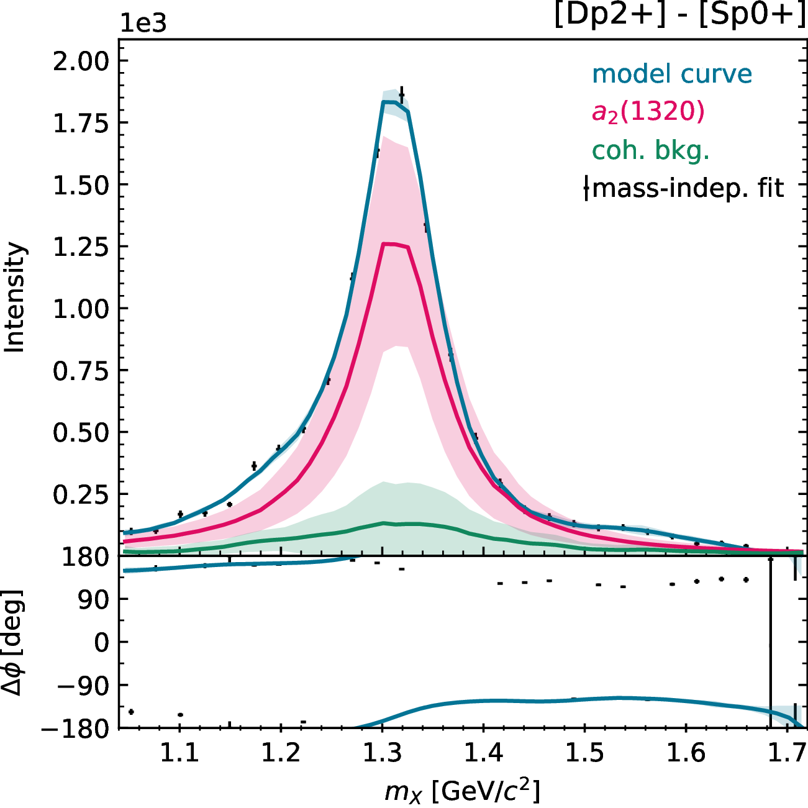
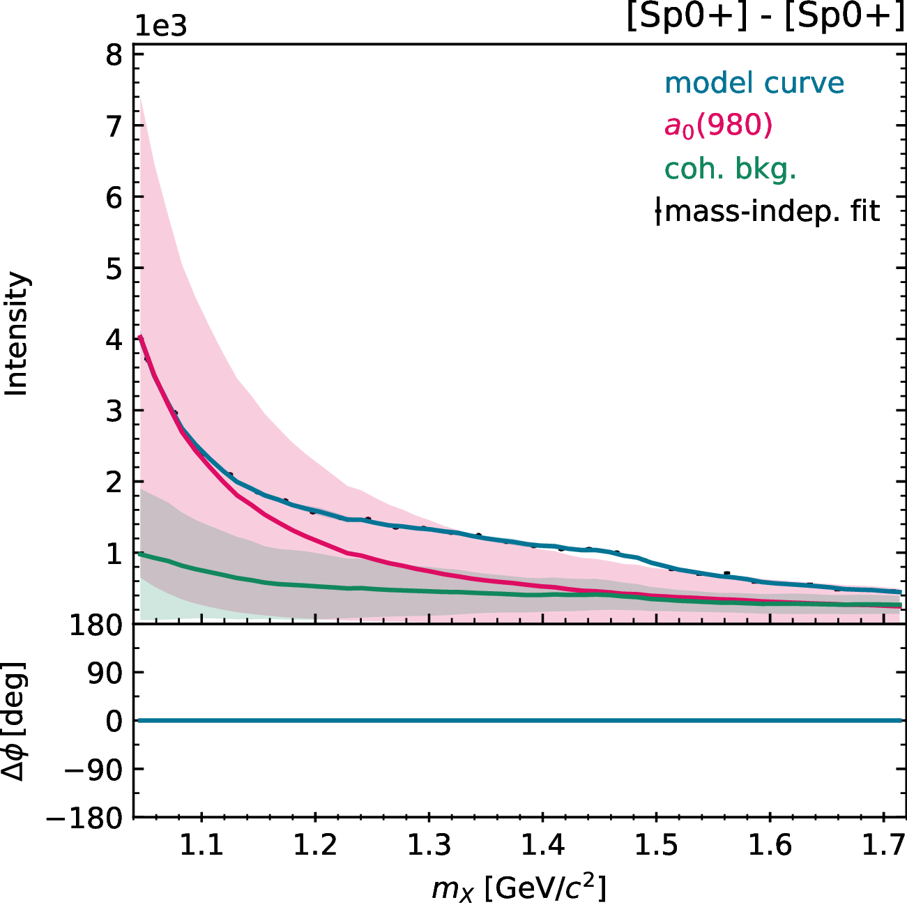
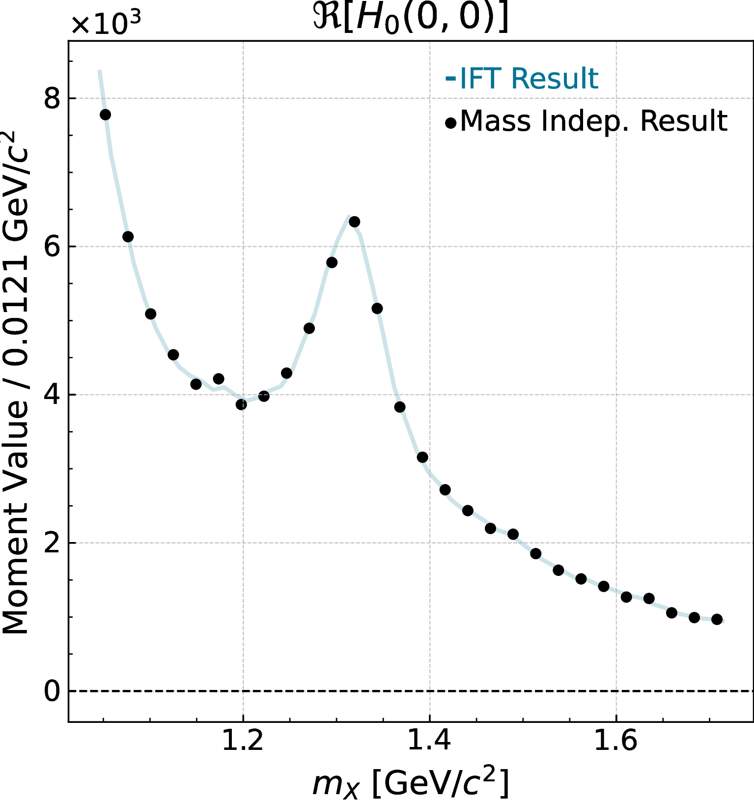
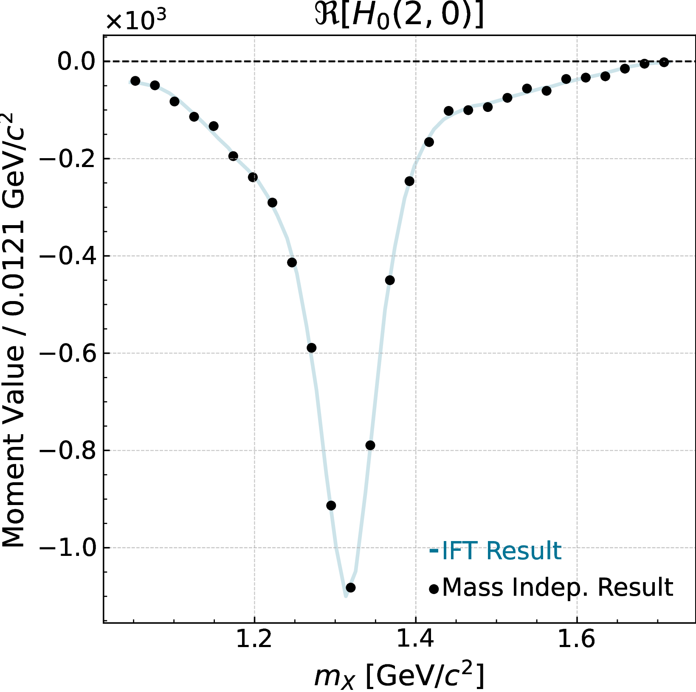
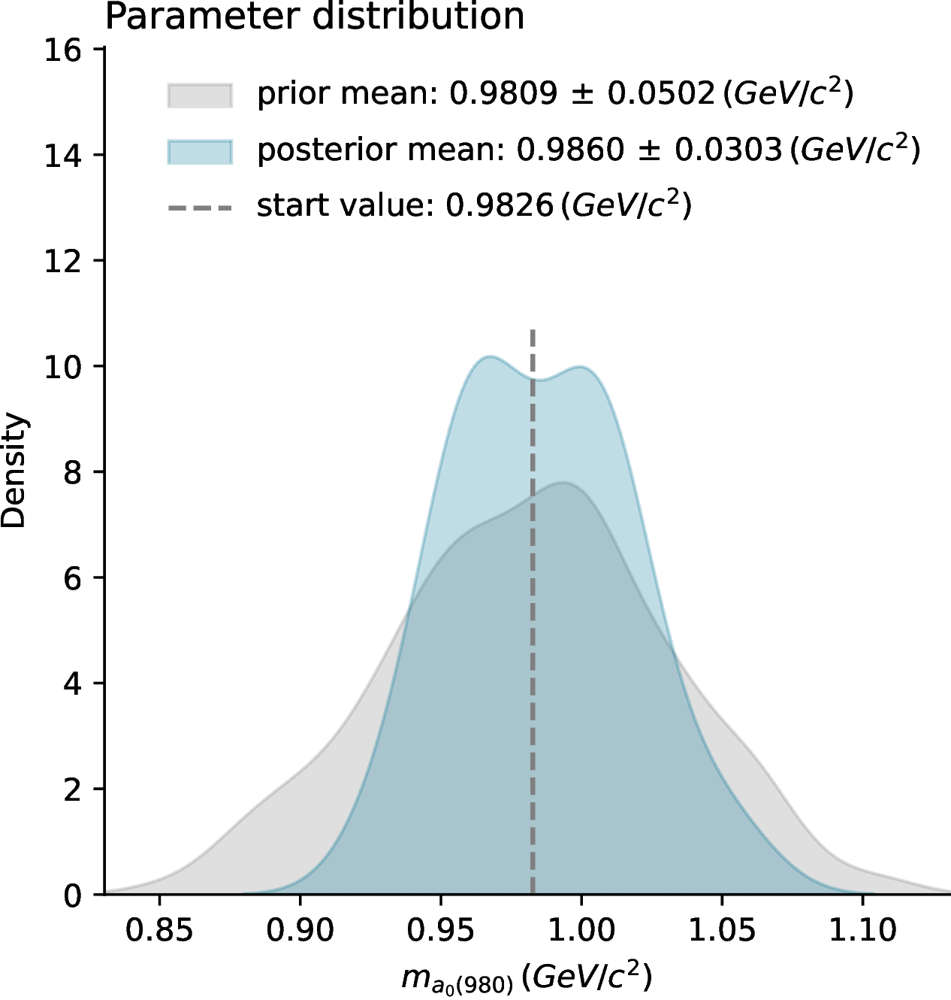
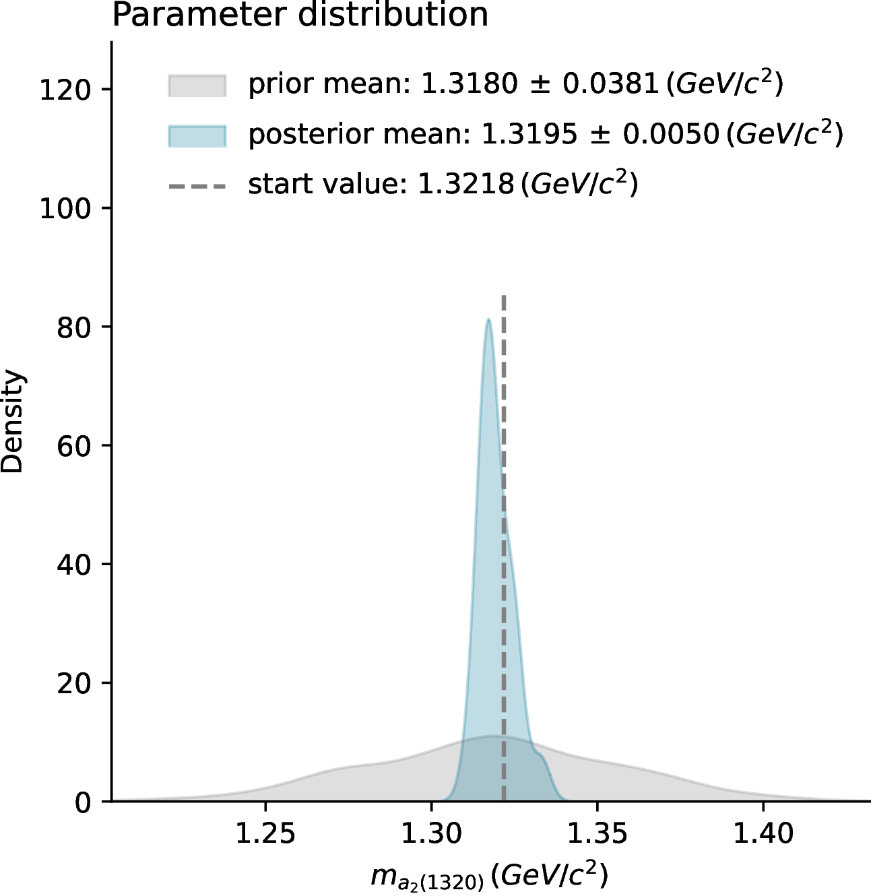
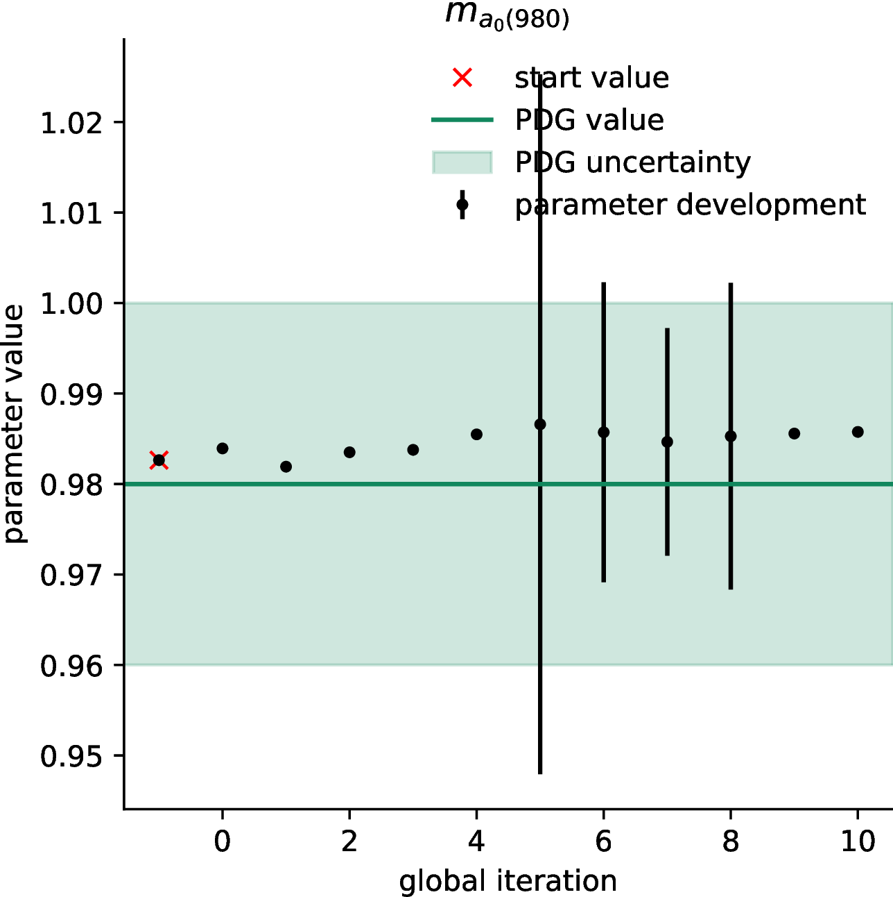
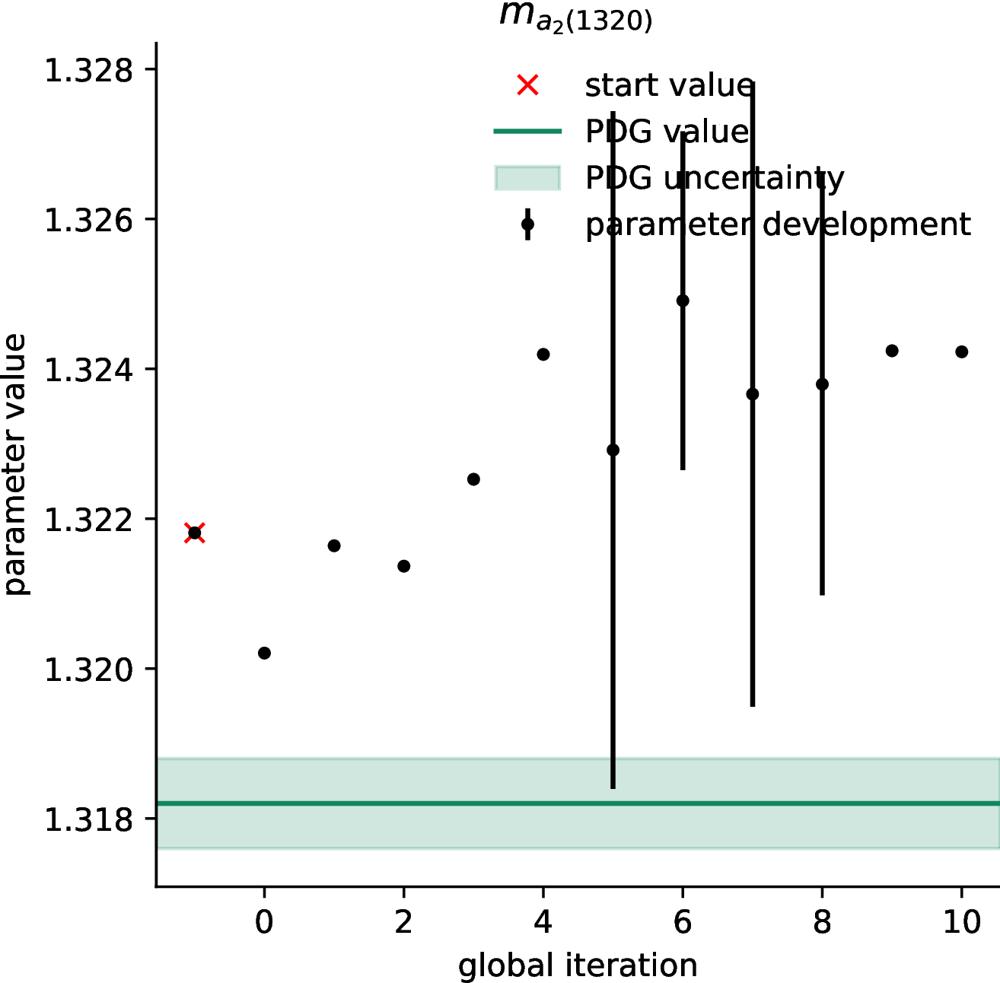

# Analysis Chain Gallery

```{note}
These plots are just for illustration purposes, optimization was not performed for very long. See [input/output analysis_chain study](demos/analysis_chain) for information on this example analysis.
```

## Partial Wave Decomposition
|  |  |
|--------------------------------|--------------------------------|

## Projection onto the moments basis
|  |  |
|--------------------------------|--------------------------------|

## KDE of Resonance Parameters
|  |  |
|--------------------------------|--------------------------------|

## Convergence Plots of Resonance Parameters
|  |  |
|--------------------------------|--------------------------------|
